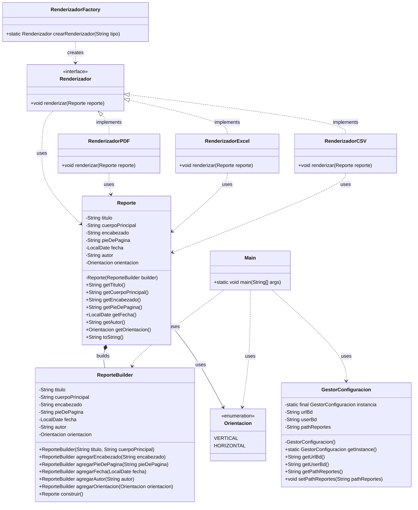

# Diagrama de Clases UML - Proyecto Reportes

Este documento contiene el diagrama de clases UML del proyecto de reportes que implementa tres patrones creacionales: Factory, Builder y Singleton.

## Descripción de Patrones

### 1. Factory Pattern
- **Interface**: `Renderizador`
- **Factory**: `RenderizadorFactory` - Crea instancias de diferentes tipos de renderizadores
- **Implementaciones**: `RenderizadorPDF`, `RenderizadorExcel`, `RenderizadorCSV`
- **Propósito**: Centralizar la creación de objetos renderizadores según un tipo especificado

### 2. Builder Pattern
- **Product**: `Reporte` - Objeto complejo que necesita construcción paso a paso
- **Builder**: `ReporteBuilder` - Clase estática interna que construye objetos `Reporte`
- **Enum**: `Orientacion` - Define la orientación del reporte
- **Propósito**: Construir objetos `Reporte` de manera flexible con atributos obligatorios y opcionales

### 3. Singleton Pattern
- **Singleton**: `GestorConfiguracion`
- **Características**:
  - Instancia única privada y estática
  - Constructor privado
  - Método estático `getInstance()` para obtener la instancia
- **Propósito**: Garantizar una única instancia global de configuración en toda la aplicación

